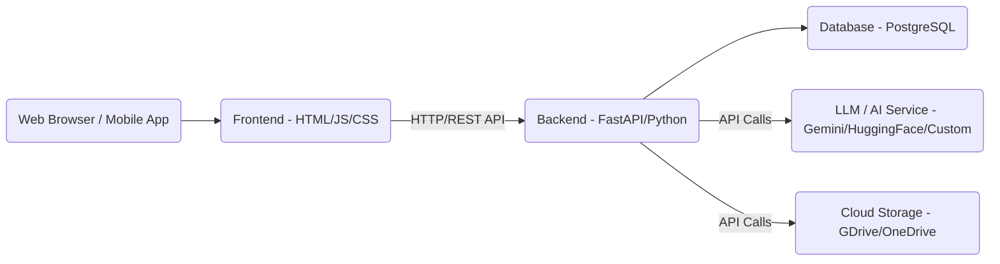

# StudyBuddy AI - Technical Architecture Document

## 1. Introduction
This document outlines the technical architecture for the StudyBuddy AI application, translating the UX design into a concrete implementation plan. It covers the technology stack, application structure, proposed file organization, and a preliminary database schema.

## 2. Technology Stack

### 2.1 Backend
*   **Language:** Python
*   **Framework:** FastAPI
    *   **Reasoning:** High performance (ASGI), modern, easy to learn, robust for API development, automatic OpenAPI (Swagger) documentation.
*   **Database:** PostgreSQL (for relational data)
    *   **Reasoning:** Robust, open-source, ACID compliant, widely supported, good for structured user data and study set metadata.
*   **ORM:** SQLAlchemy (with AsyncPG for async support)
    *   **Reasoning:** Powerful and flexible ORM for Python, provides a high-level API for database interactions, supports async operations.
*   **AI/ML Integration:**
    *   Local models for initial processing or Hugging Face Transformers.
    *   Potential integration with cloud-based LLM APIs (e.g., Google Gemini, OpenAI GPT) for more advanced text generation (summaries, quizzes) and image analysis for visual flashcards.
*   **Authentication:** OAuth2 with JWT (JSON Web Tokens)
    *   **Reasoning:** Standard and secure way to handle user authentication and authorization.
*   **Cloud Storage Integration:** API integrations with Google Drive, OneDrive for user file uploads/storage.

### 2.2 Frontend
*   **Framework:** HTML5 Templates (rendered by FastAPI)
    *   **Reasoning:** Aligns with the "simple web UI" for an MVP, leveraging FastAPI's template capabilities.
*   **Styling/Components:** Bootstrap 5 (with Material Design principles and custom theming)
    *   **Reasoning:** Provides a robust, responsive, and accessible foundation, allowing for rapid UI development while maintaining a sleek aesthetic.
*   **Interactivity:** Vanilla JavaScript for dynamic UI elements (e.g., hamburger menu, dropdowns, quiz interactions).

## 3. Application Architecture

### 3.1 High-Level Overview
The application will follow a client-server architecture with a clear separation of concerns between the backend API and the frontend presentation.



### 3.2 Backend Structure (FastAPI)
*   **Main Application (`main.py`):** Entry point, routing, global middleware.
*   **API Endpoints:**
    *   `/auth`: User registration, login, logout, password reset.
    *   `/users`: User profile management.
    *   `/documents`: Document upload, management (CRUD).
    *   `/study-sets`: Creation, retrieval, update, deletion of study sets.
    *   `/flashcards`: Flashcard generation, management, study sessions.
    *   `/quizzes`: Quiz generation, management, taking quizzes, results.
    *   `/integrations`: Cloud storage connections.
*   **Business Logic Layer:** Services responsible for core application logic, interacting with ORM and external APIs.
*   **Data Access Layer:** Models and database session management using SQLAlchemy.
*   **AI/ML Module:** Handles interactions with LLMs for text processing, summary, flashcard, and quiz generation.

### 3.3 Frontend Structure (HTML Templates & JS)
*   **Templates:** Jinja2 templates rendered by FastAPI for each major page (Home, How It Works, Features, Pricing, Login/Sign Up).
*   **Static Assets:** CSS (Bootstrap, custom styles), JavaScript (Vanilla JS for interactivity), images.
*   **Component-based Approach:** Reusable UI components (buttons, cards, navigation elements) will be developed and integrated into templates.

## 4. Directory Structure (Proposed)

```
.
├── app/
│   ├── api/                 # FastAPI API endpoints
│   ├── core/                # Core configurations, middleware
│   ├── db/                  # Database models, migrations
│   ├── services/            # Business logic
│   ├── static/              # CSS, JS, images (static assets)
│   ├── templates/           # Jinja2 HTML templates
│   └── main.py              # FastAPI application entry point
├── components/              # Reusable UI component HTML/CSS/JS snippets
├── docs/                    # Architecture, UX, user journeys, etc.
│   ├── architecture.md
│   ├── ux-design-progress-summary.md
│   ├── ux-design-specification.md
│   ├── ux-color-themes.html
│   ├── user-journey-upload-document.md
│   ├── user-journey-take-quiz.md
│   └── user-journey-authentication.md
├── tests/                   # Unit and integration tests
├── .env.example             # Environment variables
├── Dockerfile               # Docker configuration
├── requirements.txt         # Python dependencies
├── README.md
└── (other config files)
```

## 5. Preliminary Database Schema

### 5.1 Entities

*   **User:**
    *   `id` (PK, UUID)
    *   `email` (UNIQUE, String)
    *   `hashed_password` (String)
    *   `created_at` (DateTime)
    *   `last_login_at` (DateTime)
    *   `cloud_storage_connected` (Boolean)
    *   `cloud_storage_provider` (String, e.g., 'google_drive', 'onedrive')
    *   `cloud_storage_access_token` (String, ENCRYPTED)

*   **Document:**
    *   `id` (PK, UUID)
    *   `user_id` (FK to User.id)
    *   `filename` (String)
    *   `file_path` (String) # Path in cloud storage or internal storage
    *   `file_type` (String, e.g., 'pdf', 'docx')
    *   `uploaded_at` (DateTime)
    *   `status` (String, e.g., 'uploaded', 'processing', 'processed', 'failed')

*   **StudySet:** (Represents the collection of generated tools from one document)
    *   `id` (PK, UUID)
    *   `document_id` (FK to Document.id, UNIQUE)
    *   `user_id` (FK to User.id)
    *   `title` (String, derived from document or user input)
    *   `category` (String, user-definable, e.g., 'History 101')
    *   `generated_at` (DateTime)

*   **Summary:**
    *   `id` (PK, UUID)
    *   `study_set_id` (FK to StudySet.id)
    *   `content` (Text)
    *   `generated_at` (DateTime)

*   **Flashcard:**
    *   `id` (PK, UUID)
    *   `study_set_id` (FK to StudySet.id)
    *   `question` (Text)
    *   `answer` (Text)
    *   `image_url` (String, NULLABLE)
    *   `symbol` (String, NULLABLE)
    *   `difficulty` (Integer, 1-5)

*   **Quiz:**
    *   `id` (PK, UUID)
    *   `study_set_id` (FK to StudySet.id)
    *   `quiz_type` (String, e.g., '15_min', '1_hour')
    *   `generated_at` (DateTime)

*   **QuizQuestion:**
    *   `id` (PK, UUID)
    *   `quiz_id` (FK to Quiz.id)
    *   `question_text` (Text)
    *   `question_type` (String, e.g., 'multiple_choice', 'true_false')
    *   `correct_answer` (Text)

*   **QuizOption:** (For multiple-choice questions)
    *   `id` (PK, UUID)
    *   `quiz_question_id` (FK to QuizQuestion.id)
    *   `option_text` (Text)
    *   `is_correct` (Boolean)

*   **UserQuizAttempt:**
    *   `id` (PK, UUID)
    *   `user_id` (FK to User.id)
    *   `quiz_id` (FK to Quiz.id)
    *   `started_at` (DateTime)
    *   `completed_at` (DateTime, NULLABLE)
    *   `score` (Integer, NULLABLE)
    *   `total_questions` (Integer)

*   **UserAnswer:**
    *   `id` (PK, UUID)
    *   `user_quiz_attempt_id` (FK to UserQuizAttempt.id)
    *   `quiz_question_id` (FK to QuizQuestion.id)
    *   `selected_option_id` (FK to QuizOption.id, NULLABLE)
    *   `user_text_answer` (Text, NULLABLE)
    *   `is_correct` (Boolean, NULLABLE)
    *   `answered_at` (DateTime)

## 6. Future Considerations
*   **Scalability:** How will the architecture scale with increasing users and data? (e.g., message queues for AI processing, load balancing).
*   **Security:** Detailed plan for data encryption, access control, and vulnerability management.
*   **Deployment:** CI/CD pipelines, containerization (Docker, Kubernetes), cloud provider (AWS, GCP, Azure).
*   **Monitoring & Logging:** Tools for application performance monitoring, error tracking, and logging.
*   **Test Strategy:** Unit, integration, and end-to-end testing.
*   **Admin Interface:** How will administrators manage users and content?