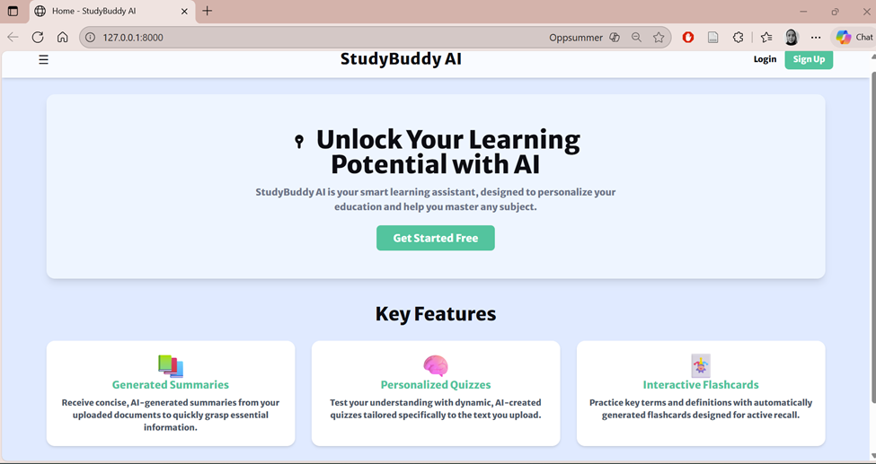

Refleksjonsrapport - Programmering med KI

1. Gruppeinformasjon
   Gruppenavn: SG - Oslo
   Gruppemedlemmer:
   • Birgitte Bellsund - 201583/birgitte.bellsund@himolde.no
   • Hamdi Abdi Mohamed - Student-ID/hamdi.a.mohamed@himolde.no
   • Kine Marie Pettersen - Student-ID/kine.m.pettersen@himolde.no
   Dato: 16.11.2025

# 2. Utviklingsprosessen

### 2.1 Oversikt over prosjektet

Prosjektet StudyBuddy-AI realiserer kjerneverdien i applikasjonen: å transformere opplastet læringsstoff (PDF/DOCX) til personlige sammendrag, flashcards og quizer. Brukeren laster opp et dokument, backend trekker ut tekst, og en KI-tjeneste (primært Google Gemini, eventuelt OpenAI GPT-4) genererer læringsressurser som lagres i Firestore og vises i et interaktivt grensesnitt. Målet er å gi studenter en intuitiv og effektiv måte å bearbeide store mengder akademisk tekst på, slik at de lettere kan lære gjennom aktiv repetisjon og selvtesting. Prosjektet kombinerer teknologi, pedagogikk og KI for å redusere tiden fra rått fagstoff til strukturert, anvendbart læringsmateriale, og demonstrerer samtidig en praktisk og etisk bruk av generativ KI i høyere utdanning.

### 2.2 Arbeidsmetodikk

Arbeidet ble organisert etter en lettversjon av Agile-metodikk, med korte iterasjoner og tydelige delmål basert på akseptansekriteriene (AC 2.1–2.5). For å sikre læring for alle besluttet vi at hvert medlem skulle delta i alle deler av prosessen – planlegging, koding, testing og dokumentasjon. Dette styrket forståelsen av helheten og forbedret samarbeid og kommunikasjon.
Gruppen startet med fire medlemmer, men i uke 45 valgte Sara å avslutte deltakelsen fordi arbeidsform og tempo ikke passet hennes preferanser. Resten av gruppen fordelte ansvar basert på styrker: Birgitte bidro med struktur, kritiske spørsmål og detaljfokus, Hamdi hadde teknisk erfaring og var spesielt god på å lese og rette kodefeil, mens Kine, som var helt ny i programmering, brukte prosjektet til å lære gjennom aktiv deltakelse.
Samarbeidsverktøy: Vi brukte VSC til utvikling, GitHub til versjonskontroll og pull requests med kodegjennomgang, og Teams til kommunikasjon, møter og avklaringer.
KI var en sentral støtte gjennom hele utviklingsprosessen. Gemini-integrasjonen i VSC ble brukt til å kommunisere med agenter, gjennomføre idémyldring og få forslag til kodeforbedringer. I tillegg brukte vi ChatGPT, spesielt til feilsøking og tolkning av feilmeldinger. ChatGPT forklarte feilmeldingene, foreslo løsninger og hjalp oss å forstå hvorfor koden ikke fungerte som forventet.

## 2.3 Teknologi og verktøy

For å realisere StudyBuddy AI-applikasjonen ble det etablert en teknologisk stack som kombinerte eksterne skytjenester med programvarebiblioteker. Valget av eksterne verktøy var i stor grad basert på Googles økosystem, som tilbyr sømløs integrasjon og fordelaktige betingelser for utvikling. Backend for applikasjonen ble utviklet med FastAPI, et Python-rammeverk, og ble kjørt på en Uvicorn ASGI-server. Tekstuttrekk fra brukernes dokumenter ble utført ved hjelp av biblioteker som `pdfminer.six` for PDF-filer og `python-docx` for Word-dokumenter. Den sentrale AI-komponenten i applikasjonen var Googles Gemini AI-modell (gemini-flash-latest), som ble aksessert via en sikret Google API-nøkkel. Denne modellen prosesserte råteksten fra dokumentene for å generere strukturerte sammendrag, flashcards og quizer. All data (brukerinformasjon, studiemateriell, kategorier og quizresultater) ble administrert gjennom Firebase. Firebase Authentication håndterte brukerregistrering og innlogging, mens Firestore fungerte som en NoSQL-database for datalagring. Et viktig teknisk aspekt var behovet for å konfigurere spesifikke sammensatte indekser (composite indexes) i Firestore. Dette var nødvendig for å muliggjøre avanserte databaseoperasjoner som filtrering og sortering, hvilken støttet funksjonalitet som kategorisering og progresjonssporing. Brukergrensesnittet ble konstruert dynamisk ved hjelp av Jinja2 som mal-motor. For design og visuell presentasjon ble Tailwind CSS benyttet for et responsivt design. Interaktive elementer som progresjonsgrafen ble visualisert med Chart.js. Tekstformatert innhold, slik som AI-genererte sammendrag i Markdown, ble presentert ved hjelp av Showdown.js. Gjennom hele utviklingsprosessen ble GitHub anvendt for versjonskontroll, noe som sikret en strukturert utviklingsflyt.

### 2.4 Utviklingsfaser

Fase 1: Planlegging
I denne fasen tok vi i bruk BMADs agent for å brainstorme med SCAMPER-metoden for å komme frem til nye funksjoner og forbedringer for StudyBuddy. Vi fokuserte blant annet på en smartere måte å organisere generert læringsmateriale (quiz, sammendrag, flashcards), økt brukerengasjement og en enklere systemarkitektur. De mest relevante resultatene fra brainstormingen var et AI-drevet Topic Map som automatisk strukturerer læringsmateriale. Videre kom vi frem til micro-læring med korte og fleksible økter i tillegg til lengre økter. Et annet resultat fra brainstormingen besto i å introdusere skylagring hos bruker istedenfor intern applagring, noe som reduserer kompleksitet og ekstra arbeid og kostnad ift lagring av materiale. I tillegg kom vi frem til en omvendt arbeidsflyt der AI først kartlegger brukerens mål før en skreddersydd studieplan blir laget. Disse forslagene bidro til å skape en mer adaptiv, effektiv og personlig læringsopplevelse i StudyBuddy AI.

Fase 2: Utvikling

I utviklingsfasen startet arbeidet med å synkronisere det lokale repositoriet med main-grenen, og vi identifiserte "Install frontend dependencies" som neste steg i arbeidsflyten. Et innledende forsøk på å kjøre npm install i frontend-mappen feilet på grunn av manglende package.json. Problemet ble midlertidig løst ved å opprette en fil med basisavhengigheter for å fullføre installasjonen. Etter vellykket installasjon ble denne filen umiddelbart fjernet.
Vi gikk videre med å etablere en ny React-applikasjon i mappen new-frontend ved bruk av create-react-app. Under hele prosessen ble statusfilen bmm-workflow-status.md kontinuerlig oppdatert for å dokumentere fullførte steg og angi det neste logiske steget, nemlig å starte utviklingsserveren for den nye frontend-applikasjonen. Til slutt ble alle endringer, inkludert den fullstendige frontend-applikasjonen, committet til repositoriet.

Fase 3: Løsningsdesign og Arkitektur

I denne fasen tok vi grunnleggende arkitektur- og designvalg. For backend-plattformen valgte vi bevisst å bygge på Googles økosystem. Vi benyttet Firebase Authentication for brukerhåndtering og Firestore som NoSQL-database. Hovedgrunnen var den tette og enkle integrasjonen med Google Gemini, vår valgte AI-modell. I tillegg tilbyr Firebase en sjenerøs gratisplan som er ideell for et prosjekt i en tidlig fase, og håndterer kompleks infrastruktur som autentisering og sanntidsdatabase med minimalt oppsett.
For brukergrensesnittet diskuterte vi og valgte en design-strategi basert på prinsipper fra Material Design, som er utviklet av Google kjent for sitt rene og intuitive brukergrensesnitt som simulerer fysiske objekter med skygger og bevegelse. Dette valget ga en god balanse mellom rask utvikling og et profesjonelt, tilgjengelig og intuitivt design, uten å måtte bygge alle komponenter fra bunnen av. Senere i fasen, for å sikre en strukturert utvidelse av applikasjonen, utarbeidet vi en detaljert teknisk spesifikasjon (tech-spec-advanced-features.md) for nye, avanserte funksjoner som kategorisering og progresjonssporing. Dette sikret at vi hadde en klar plan før implementeringen startet.

Fase 4: Iterativ Implementering og Validering

Denne fasen dekker all den praktiske kodingen og feilrettingen, som vi har utført i flere steg:

1. Kjernefunksjonalitet:
   Først bygget vi ut applikasjonens kjerneflyt. Dette inkluderte oppsett av Firebase Authentication for sikker innlogging, implementering av filopplasting (PDF/DOCX), og integrasjon mot Google Gemini API for å håndtere den første genereringen av sammendrag, flashcards og quizer. Vi satte opp en enkel visning for dette i study_session.html.
2. Avanserte Funksjoner:
   Deretter implementerte vi de avanserte funksjonene fra spesifikasjonen i fase 3. Vi utvidet main.py med nye API-er og oppdaterte frontend-malene (dashboard.html og study_session.html) for å støtte den nye funksjonaliteten, inkludert en interaktiv graf for progresjon.
3. Testing og Feilretting:
   Gjennom vår testing avdekket vi flere kritiske feil. Vi diagnostiserte og løste problemer knyttet til manglende sammensatte indekser i Firestore, som var nødvendige for de nye, komplekse databasespørringene. Vi fant og rettet også en kodefeil i main.py som forhindret quizer i å laste (404-feil).
4. Forbedring og Innhold:
   Til slutt fokuserte vi på brukeropplevelsen. Vi justerte AI-prompten for å sikre et jevnere antall flashcards. Vi skrev også om og redesignet "How It Works"-siden for å være mer engasjerende og pedagogisk, og opprettet en helt ny, funksjonell FAQ-side basert på prosjektets proposal.md.

# 3. Utfordringer og løsninger

### 3.1 Tekniske utfordringer

Utfordring 1: [Begrensning i Gemini CLI ]
Problem: Maksimumskvoten for bruk av Gemini CLI ble oppbrukt etter intensiv bruk, noe som førte til at videre bruk ble stanset til neste dag. Systemet ga en feilmelding om at kvoten var nådd, og det var nødvendig å vente i 24 timer før full tilgang ble gjenopprettet.
Løsning: Ingen umiddelbar løsning forelå, og prosjektteamet måtte avvente gjenopprettelsestiden.
KI sin rolle: KI informerte om kvotegrensene og nødvendig ventetid, men kunne ikke tilby noen metode for å omgå begrensningen eller optimalisere ressursbruken utover standard beskjed om å vente.
Utfordring 2: [Feil i tester relatert til API-nøkkel]
Problem: API-nøkkelen manglet eller var feilplassert, noe som førte til autentiseringsfeil og stopp i testkjøringen.
Løsning: Ved hjelp av eksterne KI-baserte chatboter (Gemini, Perplexity, ChatGPT) ble det avklart at API-nøkkelen måtte plasseres korrekt, enten i en .env-fil i en spesifikk mappe eller som en miljøvariabel, for å sikre funksjonalitet i Gemini CLI.
KI sin rolle: Gemini CLI ga utilstrekkelig veiledning ved feil, mens eksterne AI-verktøy raskt ga konkrete og nyttige forklaringer og løsninger som effektivt løste problemet.
Utfordring 3: [Gemin CLI står fast i bekreftelsesloop]
Problem: I enkelte tilfeller oppstod en situasjon hvor Gemini CLI gjentatte ganger ba om bekreftelse fra oss uten å utføre oppgaven, selv ved avbrudd og gjentatte forsøk. Selv når vi forsøkte å bekrefte med (yes/y) ble dette svaret stilt i kø.
Løsning: Gjennom andre KI-verktøy som ChatGPT og Perplexity ble problemet diagnostisert, og det ble gitt en kodekommando for å deaktivere behovet for ekstra bekreftelse, som således løste loopen.
KI sin rolle: Andre KI-verktøy var avgjørende for å identifisere og løse denne tekniske utfordringen, noe Gemini CLI alene ikke klarte.

### 3.2 Samarbeidsutfordringer

En sentral samarbeidsutfordring var ulikt erfaringsnivå innen programmering. Noen hadde tidligere erfaring, andre var helt nye. Dette krevde ekstra tålmodighet og støtte, spesielt i de tekniske fasene. For å sikre læringsutbytte for alle fikk hvert medlem prøve seg på flere deler av prosessen – koding, testing og dokumentasjon – slik at alle fikk en helhetlig systemforståelse.
Kommunikasjonen ble tidlig flyttet fra Jira til Microsoft Teams, som fungerte bedre som samarbeidsverktøy. Teams ble brukt til ukentlige møter, deling av kode og løpende avklaringer. Dette ga bedre kontinuitet og færre misforståelser.
Da Sara valgte å trekke seg i uke 45 på grunn av ulik oppfatning av tempo og arbeidsmetode, oppsto behov for omstrukturering. Arbeidsplanen ble justert, og de gjenværende medlemmene fordelte oppgavene mer strategisk etter kompetanse og kapasitet. Omstillingen ga økt arbeidsmengde på kort sikt, men styrket samarbeidet og ansvarsbevisstheten. Det ble lagt vekt på godt arbeidsmiljø og åpen kommunikasjon, slik at alle følte seg trygge på egne oppgaver og bidrag. Dette gjorde at mye av læringen og problemløsningen måtte håndteres internt i gruppen eller ved hjelp av KI-verktøy. Til tross for dette ble samarbeidet internt styrket. Vi ble mer selvstendige og lærte å finne løsninger på egen hånd. Samtidig viste erfaringen hvor viktig tydelig struktur, tilgjengelig veiledning og stabile læringsressurser er for at nettbaserte prosjekter skal fungere godt.

### 3.3 KI-spesifikke utfordringer

I utviklingen av StudyBuddy-AI opplevde vi flere utfordringer som var direkte knyttet til bruken av KI-verktøy. Selv om Gemini ga oss raskt fremdrift, genererte den flere ganger kode som virket korrekt, men som viste seg å være ufullstendig eller basert på feil antakelser. Et eksempel på det var at applikasjonen feilet under testing fordi KI-en ikke hadde tatt høyde for nødvendig konfigurering av Firebase-nøkkel, Google API-nøkkel og miljøvariabler. Dette måtte vi rette manuelt. Vi erfarte også inkonsistent kvalitet, der KI-en gikk inn i loops, forsøkte å starte applikasjonen selv eller brukte unødvendig lang tid uten fremgang. I tillegg foreslo den av og til kode med feil import-stier, referanser til filer som ikke eksisterte, eller funksjoner som ikke var kompatible med prosjektet vårt. For å håndtere dette måtte vi teste ofte, lese feilmeldinger selv og gi KI-en mer presis feedback. Vår erfaring er at KI fungerer godt som støtteverktøy, men at man trenger en viss forhåndskunnskap for å feilsøke riktig og formulere gode, målrettede prompter. Selv om Gemini har tilgang til hele repoet, jobber den fortsatt ut fra tekstlige mønstre og antakelser, ikke fra faktisk kjøring av applikasjonen. Derfor blir teknisk forhåndskunnskap viktig for å oppdage når noe er satt opp feil, rydde opp i buggene og gi KI-en mer presise og realistiske føringer. Uten dette risikerer man å akseptere feilaktige løsninger eller bruke lang tid på misforståelser.

# 4. Kritisk vurdering av KI sin påvirkning

### 4.1 Fordeler med KI-assistanse

KI bidro til å øke læring og effektivitet i utviklingsprosessen. Gemini ble integrert i Visual Studio Code og brukt til å generere kodeforslag, forklare logikk og strukturere funksjoner, noe som reduserte tid brukt på research og manuell feilsøking. ChatGPT supplerte dette, særlig ved tolkning av feilmeldinger og forklaring av årsaker til feil. Begge verktøy ble brukt aktivt i idémyldring, der vi testet ulike løsninger for arkitektur, funksjonalitet og brukerflyt.
Læring og forståelse: For medlemmer med mindre programmeringserfaring fungerte KI som et personlig læringsverktøy. Ved å stille spørsmål til Gemini og ChatGPT fikk de raskt forklaringer på begreper, syntaks og funksjonslogikk, noe som styrket forståelsen og gjorde det enklere å delta i tekniske diskusjoner. KI ble brukt til å utforske konsepter, rette feil og forbedre kode. For mer erfarne medlemmer ble KI et verktøy for å validere ideer og heve kvaliteten på løsninger.
Kvalitet på koden KI-verktøyene bidro også til en mer strukturert og robust kodebase. Gemini foreslo forbedringer innen lesbarhet, feilhåndtering og optimalisering, og hjalp med å oppdage svakheter tidlig i utviklingsløpet. ChatGPT bidro med alternative løsninger og bedre forståelse av feilmeldinger, som ofte førte til forbedrede implementasjoner.

### 4.2 Begrensninger og ulemper

Kvalitet og pålitelighet: Selv om KI-verktøyene ga rask fremdrift, var kvaliteten på svarene ikke alltid pålitelig. Spesielt ved bruk av Gemini opplevde vi at koden til tider inneholdt syntaksfeil, utdaterte biblioteker eller manglende forståelse av sammenhengen i prosjektet. Dette understreker behovet for menneskelig kontroll og kritisk vurdering av KI-generert innhold.
Avhengighet og forståelse: I starten stolte vi for mye på KI uten å reflektere nok over resultatene. Kode ble tatt videre uten grundig vurdering, og vi oppdaget i etterkant at enkelte løsninger var feil eller lite hensiktsmessige. I tillegg ble ikke promptene lagret systematisk, noe som gjorde det vanskelig å spore hva som var gjort og hvorfor. Dette ble en viktig læring. Etter de første fasene innførte vi en mer strukturert praksis: vi lagret alle KI-prompter, dokumenterte svar og ba Gemini lage korte sammendrag fra hver fase. Dermed gikk vi fra å bruke KI som et “hurtigverktøy” til å bruke det som en integrert lærings- og dokumentasjonsressurs.
Kreativitet og problemløsning: KI-forslagene var ofte konvensjonelle og ikke nødvendigvis innovative. Gruppen måtte derfor aktivt utfordre forslagene for å tenke utover standardløsninger. Det ble viktig å bruke KI som støtte, ikke som erstatning for egen refleksjon og problemløsning.

### 4.3 Sammenligning: Med og uten KI

KI hadde stor betydning for hvordan gruppen kunne gjennomføre prosjektet uten inngående kunnskap om alle verktøyene. KI forklarte løpende og foreslo forbedringer, slik at vi kunne fokusere mer på struktur og funksjonalitet.
Uten KI-støtte ville læringskurven vært brattere, men med en dypere teknisk forståelse og en mer inngående forståelse av de ulike fasene i utviklingen. Vi måtte brukt betydelig mer tid på grunnleggende konsepter, biblioteker, syntaks, dokumentasjon og feilhåndtering. Med den tilgjengelige tiden ville det vært lite realistisk å oppnå samme funksjonalitet og kvalitet. Prosjektet ville trolig hatt lavere funksjonalitet, men høyere faglig dybde. Med KI fikk vi et mer komplett og visuelt ferdig produkt, selv om deler av koden ble forstått på et mer overordnet nivå.

### 4.4 Samlet vurdering

KI har totalt sett hatt en tydelig positiv innvirkning på prosjektet. Uten KI ville det vært svært krevende å gjennomføre et så teknisk komplekst prosjekt innenfor tidsrammen. Gemini og ChatGPT gjorde det mulig å bygge funksjonell kode, løse problemer raskt og forstå komplekse prosesser uten inngående forkunnskap i alle språk og rammeverk.
Samtidig viste erfaringen at KI ikke kan erstatte menneskelig forståelse, kritisk tenkning og kreativitet. De første fasene illustrerte hvor lett det er å stole for mye på KI. Etter hvert ble bruken mer strukturert: vi lagret prompter, dokumenterte forslag og kvalitetssikret koden fortløpende. Overgangen fra ukritisk til målrettet bruk er en av de viktigste læringene.
Vi vurderer KI som en netto positiv faktor: den ga høyere produktivitet, bedre struktur og et mer komplett sluttprodukt enn det som realistisk kunne vært oppnådd uten KI. Samtidig tydeliggjorde prosjektet at KI bør brukes som samarbeidspartner og som et kraftig verktøy – ikke som erstatning for egen kunnskap og kreativitet.

# 5. Etiske implikasjoner

### 5.1 Ansvar og eierskap

Når KI-verktøy som Gemini og ChatGPT bidrar i kodeutvikling, oppstår spørsmålet om ansvar og eierskap. Vi mener at ansvaret for koden alltid ligger hos utvikleren, også når KI har bidratt. KI er et støtteverktøy, ikke en selvstendig skaper. Forslag fra KI må vurderes kritisk, testes og tilpasses før de tas i bruk.

### 5.2 Transparens

I dette prosjektet har vi vært åpne om bruken av Gemini og ChatGPT. Vi har dokumentert hvilke deler av koden som var foreslått av KI, og lagret prompter og svar i egne filer. Vi mener transparens er avgjørende for å opprettholde tillit mellom studenter, lærere og brukere, og at i akademiske prosjekter bør graden av KI-assistanse synliggjøres tydelig, av hensyn til etikk, faglig integritet og troverdighet.

### 5.3 Påvirkning på læring og kompetanse

Erfaringene våre viser at KI har stort potensial som læringsstøtte, men at bruken må balanseres. KI gjorde det mulig å jobbe effektivt med avanserte verktøy uten at alle hadde tung teknisk bakgrunn. Samtidig kan KI redusere behovet for aktiv problemløsning. Når man får raske svar og ferdige kodeforslag, kan den dype forståelsen av logikk og struktur svekkes. Vår erfaring tilsier at KI fungerer best som en digital mentor som støtter studentenes egen tankeprosess, ikke erstatter den.

### 5.4 Arbeidsmarkedet

Utviklere blir ikke overflødige, men kompetansebehovet endres. Det blir viktigere å forstå, validere og forbedre KI-generert kode enn å kunne alt fra bunnen av. Prosjektet vårt illustrerer hvordan KI kan senke terskelen for å delta i tekniske prosjekter. Samtidig øker kravet til kritisk tenkning, analytisk forståelse og evnen til å kommunisere presist med KI-verktøy. Vi tror ikke KI vil erstatte utviklere, men endre hva det vil si å være utvikler.

### 5.5 Datasikkerhet og personvern

Bruk av KI-verktøy reiser viktige spørsmål om datasikkerhet og personvern. Etisk sett ligger personvernansvaret hos brukeren, også når data sendes til tredjepart. I denne løsningen lagres dokumenter og genererte læringsressurser i brukerens egen private Firestore-konto, og vi som utviklere har ikke tilgang til innholdet de laster opp. Vi deler ikke filer med KI-modellen utover det som kreves for å generere sammendrag, og vi sender aldri personopplysninger i prompter. All behandling skjer innenfor Googles plattform, og dataene er isolert per bruker. Dette gjør at personvern og datasikkerhet i praksis handler om bevissthet rundt hva man laster opp – ikke om at utviklere har tilgang til materialet.

# 6. Teknologiske implikasjoner

### 6.1 Kodekvalitet og vedlikehold

KI-generert kode kan påvirke langsiktig vedlikehold. KI-generert kode kan introdusere betydelig teknisk gjeld, duplisert kode, redusert kvalitet, økt kompleksitet og færre refactoringer. Dette skaper ekstra arbeid senere via debugging, sikkerhetsfikser, rot i versjonering osv. Når man selv ikke har laget koden kan det være vanskelig å vite akkurat hvordan KI har tenkt og hvorfor det har blitt generert ulike løsninger. Videre kan det tenkes at utviklere har en tendens til å være mindre kritiske i sin gransking av KI-kode, da de mangler den naturlige ansvarsfølelsen eller eierskapet de har til egen kode. Dette skaper også en risiko for at man lettere fraskriver seg ansvaret ved feil, ved å skylde på KI-verktøyet fremfor å ta eierskap for å ha godkjent og implementert koden i prosessen.
KI-generert kode er ofte mindre intuitiv og vanskeligere å vedlikeholde sammenlignet med menneskeskrevet kode, til tross for at den kan være funksjonell. Den har en tendens til å være mer repetitiv og enkel, mens menneskeskrevet kode ofte kjennetegnes av større originalitet, kompleksitet, variasjon og tilpasningsevne

### 6.2 Standarder og beste praksis

KI følger ikke nødvendigvis alltid beste praksis og industristandarder. KI utvikler seg langt raskere enn for eksempel lover og regler gjør, samt såkalte “best practices”. KI kan også foreslå løsninger som bygger på skjevheter i treningsdata. Et typisk eksempel er rekrutteringsmodeller som viderefører bias knyttet til kjønn, etnisitet eller religion, noe som kan føre til diskriminerende vurderinger. Dette viser hvorfor KI-forslag alltid må valideres kritisk før de tas i bruk. Det er også viktig å validere KI-generert kode for å avdekke sikkerhetshull, feil og svakheter. Slik kontroll gjør det mulig å kvalitetssikre løsningen og forbedre eller justere koden før den tas i bruk.

### 6.3 Fremtidig utvikling

**_• Hvordan tror dere KI vil påvirke programvareutvikling fremover?_**
Vi tror KI vil endre utviklingsarbeidet ved å automatisere mange av de arbeidsoppgavene som tidligere tok mye tid, som grunnleggende kodeoppsett, generering av standardfunksjoner og produksjonssetting av løsning. Dette senker terskelen for å komme i gang, fordi man ikke lenger må være ekspert i hele stacken for å få en fungerende løsning. Samtidig ser vi at KI ikke forstår systemet gjennom faktisk kjøring, men gjennom tekstmønstre. Det gjør at KI ikke oppfatter arkitektur, miljøvariabler eller avhengigheter på samme måte som utviklere gjør. Fremover blir derfor utviklerrollen mer styrende: KI kan gjøre grovarbeidet, men mennesker må ta arkitekturvalg, verifisere løsninger og håndtere feil som KI ikke klarer å predikere.
**_• Hvilke ferdigheter blir viktigere for utviklere?_**
Vårt inntrykk er at teknisk dømmekraft og feilsøkingsferdigheter blir enda viktigere. Selv om KI genererer kode, må utviklere fortsatt kunne lese feilmeldinger, forstå hvor i systemet en feil oppstår, og se når KI foreslår løsninger som ikke fungerer i praksis. En grunnleggende forståelse av arkitektur, backend, frontend og datastrukturer gjør det lettere å formulere gode og presise prompter, og å oppdage når KI har misforstått noe. I tillegg blir prompt-ferdigheter en del av utviklerrollen: evnen til å sette rammer, definere parametere og være konkret i instruksene gir bedre resultater og mindre kluss. Med andre ord: KI kan skrive mye av koden, men utvikleren må fortsatt vite hva som skjer.
**_• Deres anbefalinger for hvordan man bør bruke KI i utviklingsprosesser_**
Basert på vår erfaring anbefaler vi å bruke KI som støtteverktøy, ikke som autopilot. Det fungerer best å dele arbeidet i mindre steg, la KI løse én komponent av gangen og teste umiddelbart. Når man gjør det slik, oppstår feil der de faktisk oppstår, og det blir enklere å feilsøke og justere. Vi anbefaler også å være tydelig i promptene: sett rammer, forklar konteksten og spesifiser nøyaktig hva du vil at KI skal gjøre. En viss forhåndskunnskap på tvers av stacken gjør dette mye enklere, fordi man da kan veilede KI-en mer presist og raskt oppdage feil. Til slutt bør KI brukes til førsteutkast, strukturering og repetitive oppgaver — mens utvikleren selv tester, kvalitetssikrer og styrer helheten.

# 7. Konklusjon og læring

### 7.1 Viktigste lærdommer

[Liste de 3-5 viktigste tingene dere lærte gjennom prosjektet]

1. [Lærdom 1]
2. [Lærdom 2]
3. [Lærdom 3]

### 7.2 Hva ville dere gjort annerledes?

[Reflekter over hva dere ville endret hvis dere skulle startet på nytt]
• [Tekniske valg]
• [Bruk av KI]
• [Samarbeid og organisering]

### 7.3 Anbefalinger

[Deres anbefalinger til andre studenter som skal bruke KI i utvikling]
**• [Råd om effektiv bruk av KI]**
o Bruk KI som samtalepartner og veileder, ikke som automatisk kodegenerator. Still spørsmål, be om forklaringer, og be KI utdype hvorfor en løsning fungerer. Vær presis i promptene. Jo tydeligere problemet beskrives, desto mer relevante svar. Kombiner gjerne flere KI-verktøy, for eksempel Gemini til kodeutvikling og ChatGPT til feilsøking og konseptforklaringer. Dokumenter bruken. Lagre prompter og svar underveis for å kunne spore hvilke forslag som ble brukt.
**• [Fallgruver å unngå]**
o Ikke stol blindt på kodeforslag. Selv små feil kan gi logiske problemer eller sikkerhetsbrudd. Test og forstå hva koden gjør. Unngå å bruke KI som erstatning for egen læring. Reflekter over prosessen, ikke bare resultatet. Vær forsiktig med hva du deler. Ikke legg inn sensitiv informasjon, slik som API nøkkel, passord eller filer i promptene.
**• [Beste praksis dere oppdaget]**
o Start prosjektet med felles retningslinjer for hvordan gruppen skal bruke KI – når, til hva og hvordan det skal dokumenteres. Bruk KI aktivt i brainstorming og idéutvikling for å utforske alternativer før dere velger retning. Når KI genererer kode, be også om forklaringer linje for linje for å øke læringsverdien. Sørg for at minst én i gruppen kvalitetssikrer alle forslag før de implementeres.
• Oppsummert mener vi at nøkkelen til vellykket KI-bruk er balansen mellom effektivitet og forståelse. Når KI brukes bevisst, som støtte og ikke som erstatning, kan den både styrke læringsprosessen og øke kvaliteten på sluttproduktet.
7.4 Personlig refleksjon (individuelt)
**[Birgitte]**: Først og fremst har det vært utrolig spennende og lærerikt å utvikle en app fra start til slutt, med AI som en veiviser som håndterte det tekniske på et annet abstraksjonsnivå. Det var også tilfredsstillende å se og ta i bruk det ferdige produktet. I tillegg var det svært nyttig og lærerikt å komplementere Gemini CLI med bruken av eksterne AI-verktøy som Gemini, Perplexity og ChatGPT, som ga gode og som regel brukbare løsninger og forslag til presise prompts og som var gode “sparringspartnere”. Det har også vært svært nyttig for meg å lære hvordan Github fungerer i praksis og hvordan man jobber i brancher og hva slags løsninger og utfordringer det byr på når man jobber i et team.

Samtidig har det vært utfordrende å vite nøyaktig hvor jeg befant meg i BMAD-fasene og hva som var neste steg. Det tok litt tid å lære hvordan jeg begynte igjen etter å ha avsluttet siste work session/work flows. Videre fant jeg det utfordrende å vite hvor jeg skulle avslutte brancher og hvor jeg skulle starte på nye. Jeg tror også at både jeg og teamet mitt kunne ha profitert langt mer fra dette prosjektet/faget dersom både GitHub og BMAD-metoden ble brukt mer aktivt som verktøy for samarbeid og teamstruktur fra prosjektets start. Med bedre kompetanse på dette kunne teamet fått en tydeligere felles arbeidsmåte og rollefordeling. Videre korresponderte ikke alltid tidsplaner mellom forelesninger og prosjektarbeid, og informasjonen om hvordan prosjektet kunne struktureres kom senere enn vår prosjektutvikling. En annen utfordring vi møtte, var begrenset tilbakemelding fra lærere og assistenter, noe som vi savnet og kunne ha bidratt til å løfte prosjektet.

Til slutt vil jeg trekke frem hvor fascinerende og litt skremmende KI-utviklingen i 2025 har blitt, med enormt potensial, som jeg oppdaget i dette prosjektet. Ideelt sett fungerer KI best som et kraftig støtteverktøy som komplementerer menneskelig kreativitet, innovasjon og problemløsning i app-utvikling, der det håndterer tekniske oppgaver effektivt. Samtidig er det skummelt å tenke på at KI kan og vil overta roller som potensielt begrenser vår egen evne til kreativ tenkning og selvstendig utvikling, noe som understreker behovet for å behandle det som et støttende element snarere enn en erstatning.  
**[Kine]**: Som nybegynner uten tidligere erfaring med koding har dette prosjektet vært både utfordrende og svært lærerikt. I starten opplevde jeg usikkerhet rundt mange tekniske begreper og verktøy, men bruken av KI – spesielt Gemini sammen med VSC og ChatGPT – gjorde det mulig for meg å forstå og lære i mitt eget tempo. KI hjalp meg med å oversette teknisk kode til forståelige forklaringer og gjorde det mulig å prøve, feile og lære underveis.
Samtidig har prosjektet vist meg hvor avgjørende godt samarbeid er i et gruppeprosjekt. I begynnelsen oppsto det noen utfordringer med at enkelte gruppemedlemmer ikke møtte forberedt til møtene, og at avtalte møtetider ble endret på kort varsel. I en allerede travel hverdag ble det tydelig hvor viktig det er å holde avtaler og ta ansvar for gruppens fremdrift. Et gruppeprosjekt med flere deltakere krever at alle er dedikerte – når én gjør et valg, påvirker det alle. Denne erfaringen har lært meg mye om både struktur, kommunikasjon og respekt for andres tid.
Det skal også nevnes at jeg har fått mye hjelp og støtte fra Birgitte og Hamdi, som har vært utrolig fleksible, tålmodige og hjelpsomme gjennom hele prosessen. Det har vært rom for å stille spørsmål og prøve seg frem selvom om man er usikker, det har alltid vært rom for å stille spørsmål, og vi har i flere møter jobbet sammen i VSC ved deling av skjerm for å lære.
Selv om jeg har lært mye og fått bedre forståelse for hvordan programmering og KI fungerer, ser jeg fortsatt på meg selv som en nybegynner, bare med litt mer kunnskap enn før. Jeg har fortsatt ikke forstått alt, men nå vet jeg hvor jeg skal begynne for å lære mer. Programmering har alltid vært litt høytsvevede og gresk, og det at jeg når kan sitte i VSC og promte er gøy.
Gjennom dette prosjektet har jeg ikke bare lært om programmering og KI, men også om samarbeid, ansvar og hvordan man kan vokse i møte med utfordringer. Erfaringen har gitt meg en ny forståelse av hvor mye man kan oppnå når man kombinerer teknologi, samarbeid og læringsvilje.
**[Hamdi]**: Dette faget har vært veldig nyttig fordi jeg allerede bruker KI i jobbsammenheng, men da for kodegenerering knyttet til dataanalyse, maskinlæring og tekniske rammeverk. Å bruke KI til å utvikle en full applikasjon, med både backend, frontend og systemarkitektur, var derimot nytt for meg. Derfor var det interessant å se hvordan prosjektet gradvis tok form gjennom iterative prompter, testing og korrigering. Samtidig opplevde jeg at det innimellom var vanskelig å forstå hvor vi befant oss i BMAD-fasene og hva som var neste steg, særlig fordi forelesningene noen ganger hang litt etter plan. Dette gjorde oss tidvis usikre på om vi brukte .md-filene riktig. Likevel var det en fordel at alt ble tatt opp og demonstrert, slik at vi kunne gå tilbake, se konkret hvordan fremgangsmåten var, og stille spørsmål underveis.
En av de mest verdifulle erfaringene for min del var å få en mer praktisk forståelse av applikasjonsutvikling som helhet. Selv om jeg har jobbet med kode lenge, har jeg ikke tidligere jobbet direkte med helhetlig systemutvikling eller vært ansvarlig for å kombinere backend, frontend, API-er, database og arkitektur i én sammenhengende løsning. Gjennom dette prosjektet fikk jeg kjenne på hvordan KI kan hjelpe til med å produsere koden, men at vi som utviklere likevel må forstå strukturen godt nok til å feilsøke, lese avvik, teste funksjonalitet og gi KI-en riktige føringer. Denne kombinasjonen av AI-støtte og teknisk dømmekraft ble et viktig læringspunkt for meg. Samtidig var det nyttig å få en mer praktisk forståelse av GitHub-arbeidsflyt, bruk av GIT og håndtering av merge-konflikter, og jeg opplevde veiledningen på dette som svært støttende.
Til slutt opplever jeg at dette prosjektet har motivert meg til å bygge videre på det vi har startet. Jeg ser allerede hvordan KI kan få en større og mer integrert rolle i min egen arbeidsflyt fremover, spesielt når det gjelder å kombinere AI-generert kode med egen systemforståelse for å utvikle helhetlige løsninger. For meg har dette vært mer enn et kursprosjekt; det har gitt en konkret opplevelse av hva KI faktisk kan bidra med i praktisk programvareutvikling. Jeg kommer til å skaffe fagboken når den publiseres, slik at jeg kan bygge videre på kunnskapen vi har fått her.

# 8. Vedlegg (valgfritt)

• Skjermbilder av applikasjonen

• Lenke til GitHub repository
https://github.com/IBE160/SG-Oslo/tree/main
• Annen relevant dokumentasjon
